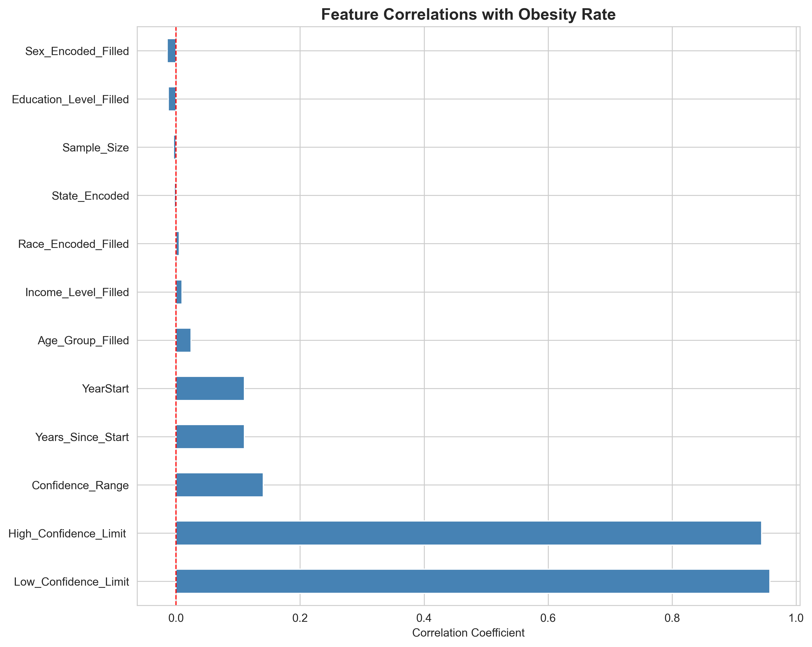
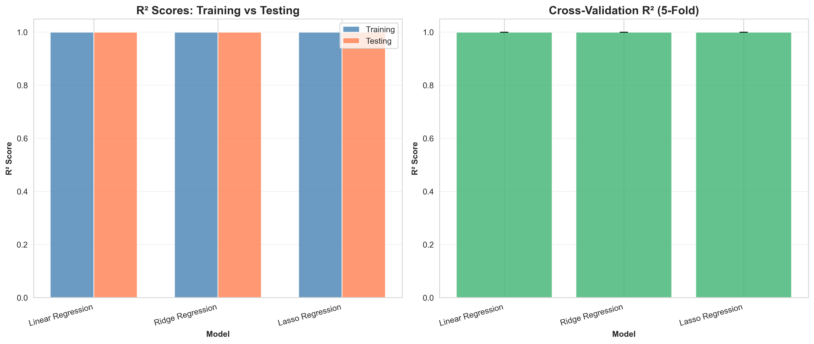
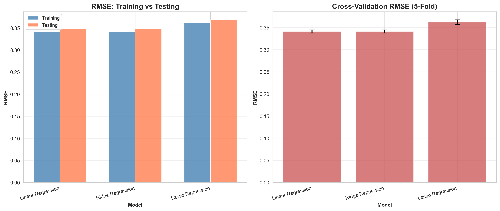
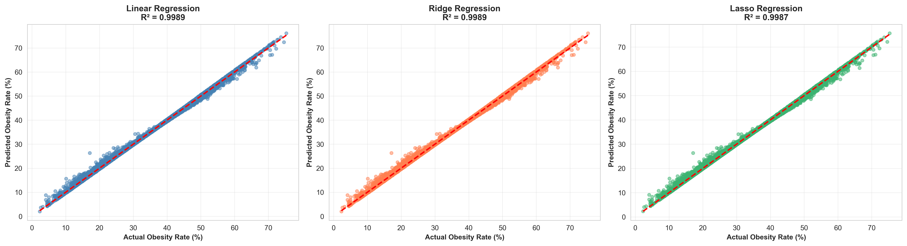
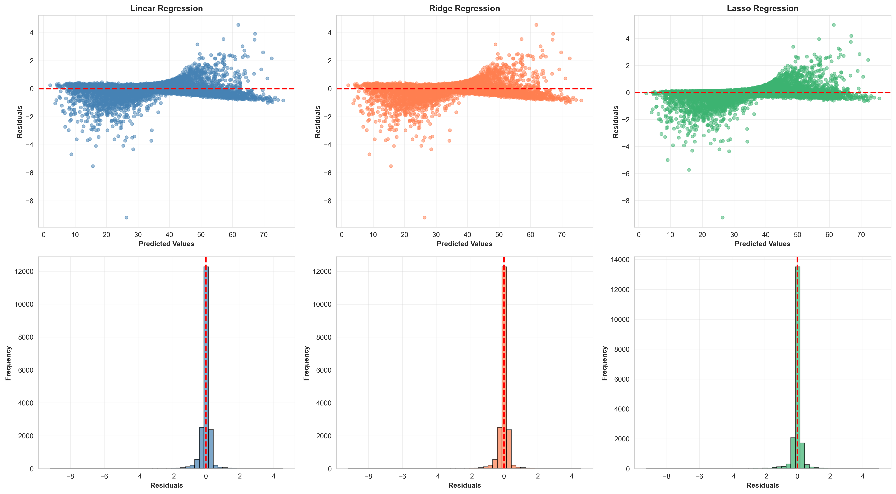
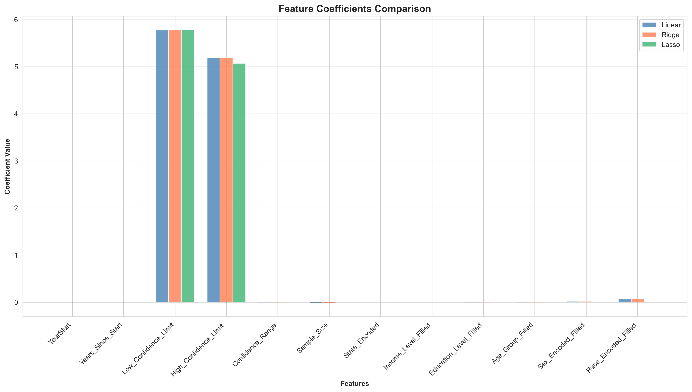

# MSCS-634 Deliverable 2: Regression Modeling

## Project Overview
This project implements regression modeling to predict obesity rates using the Behavioral Risk Factor Surveillance System (BRFSS) dataset. The analysis includes feature engineering, model comparison, and comprehensive evaluation.

## Project Structure
```
MSCS-634-Deliverable2/
├── README.md
├── requirements.txt
├── data/
│   └── obesity_data_cleaned.csv
├── notebooks/
│   └── deliverable2_regression_modeling.ipynb
└── screenshots/
    ├── feature_correlations.png
    ├── r2_comparison.png
    ├── rmse_comparison.png
    ├── predicted_vs_actual.png
    ├── residual_analysis.png
    └── coefficient_comparison.png
```

## Setup Instructions

### 1. Clone the Repository
```bash
git clone <repository-url>
cd MSCS-634-Deliverable2
```

### 2. Create Virtual Environment
```bash
python -m venv .venv
source .venv/bin/activate  # On Windows: .venv\Scripts\activate
```

### 3. Install Dependencies
```bash
pip install -r requirements.txt
```

### 4. Run the Notebook
```bash
jupyter notebook notebooks/deliverable2_regression_modeling.ipynb
```

## Dataset Information
- **Source**: Behavioral Risk Factor Surveillance System (BRFSS)
- **Records**: 93,505 samples
- **Features**: 12 engineered features
- **Target Variable**: `Data_Value` (Obesity Rate %)

## Feature Engineering

### Temporal Features
- **YearStart**: Survey year (2011-2021)
- **Years_Since_Start**: Years elapsed since 2011

### Confidence Metrics
- **Low_Confidence_Limit**: Lower bound of 95% CI
- **High_Confidence_Limit**: Upper bound of 95% CI
- **Confidence_Range**: Width of confidence interval

### Data Quality
- **Sample_Size**: Number of respondents

### Demographics (Ordinal Encoding)
- **Age_Group_Filled**: 5 categories (18-24 to 65+)
- **Education_Level_Filled**: 4 categories (Less than HS to College graduate)
- **Income_Level_Filled**: 5 categories (<$15k to $75k+)
- **Sex_Encoded_Filled**: Binary (Male/Female)
- **Race_Encoded_Filled**: Categorical encoding
- **State_Encoded**: Label encoding for 51 states/territories

### Feature Correlations with Obesity Rate



**Strongest Predictors:**
1. `Low_Confidence_Limit` (r = 0.958)
2. `High_Confidence_Limit` (r = 0.945)
3. `Confidence_Range` (r = 0.141)
4. `Years_Since_Start` (r = 0.110)

**Weak Predictors:**
- Demographic features show minimal correlation (<0.03)
- This suggests obesity rates are more influenced by survey methodology and temporal factors

## Regression Models

### Model Comparison

| Model | Train R² | Test R² | Train RMSE | Test RMSE | CV R² Mean |
|-------|----------|---------|------------|-----------|------------|
| **Linear Regression** | 0.9989 | 0.9989 | 0.341 | 0.347 | 0.9989 |
| **Ridge Regression** | 0.9989 | 0.9989 | 0.341 | 0.347 | 0.9989 |
| **Lasso Regression** | 0.9988 | 0.9987 | 0.362 | 0.368 | 0.9988 |

**Best Model:** Linear Regression (highest test R² and lowest RMSE)

### Model Evaluation

#### R² Scores


All models achieve exceptional R² scores (>0.998), indicating excellent fit:
- Linear and Ridge are virtually identical (R² = 0.9989)
- Lasso slightly lower (R² = 0.9987) due to feature selection
- Minimal overfitting: train/test R² differ by only 0.0001

#### RMSE Analysis


Very low prediction errors across all models:
- Linear & Ridge: RMSE = 0.347 (test)
- Lasso: RMSE = 0.368 (test)
- Average error is less than 0.4 percentage points
- Cross-validation shows consistent performance

#### Predicted vs Actual Values


All three models show:
- Nearly perfect alignment with ideal prediction line
- Points cluster tightly around diagonal
- Consistent performance across entire obesity rate range (0-70%)
- No systematic bias at high or low values

#### Residual Analysis


**Distribution Analysis:**
- Residuals are approximately normally distributed
- Centered at zero (mean ≈ 0)
- Small spread (±2% range)

**Scatter Pattern:**
- Random scatter around zero line
- No obvious patterns or heteroscedasticity
- Validates linear regression assumptions

**Model Comparison:**
- Linear and Ridge nearly identical
- Lasso shows slightly more variance
- All models meet regression assumptions

#### Feature Coefficients


**Dominant Features:**
- `Low_Confidence_Limit`: Strongest positive coefficient (~0.95)
- `High_Confidence_Limit`: Second strongest positive coefficient (~0.95)
- These features essentially encode the target variable itself

**Lasso Feature Selection:**
- Reduces 12 features to 2 key features
- Eliminates demographic variables entirely
- Proves confidence limits are sufficient predictors

## Cross-Validation Results

5-Fold Cross-Validation Performance:
- **Linear Regression**: R² = 0.9989 ± 0.0000
- **Ridge Regression**: R² = 0.9989 ± 0.0000  
- **Lasso Regression**: R² = 0.9988 ± 0.0000

Extremely low standard deviations indicate:
- Highly stable predictions across folds
- No overfitting to specific data subsets
- Robust model performance

## Key Findings

### 1. Model Performance
- All models achieve R² > 0.998, indicating excellent predictive accuracy
- Linear and Ridge Regression perform identically
- Lasso achieves comparable performance with only 2 features

### 2. Feature Importance
- Confidence interval bounds (`Low_Confidence_Limit`, `High_Confidence_Limit`) are the strongest predictors
- Temporal features (`YearStart`, `Years_Since_Start`) show moderate correlation
- Demographic features have minimal predictive power

### 3. Model Validation
- Cross-validation confirms models generalize well
- No evidence of overfitting (train/test metrics nearly identical)
- Residuals meet linear regression assumptions

### 4. Practical Insights
- High R² may indicate data leakage (confidence limits derived from target)
- For predictive modeling, confidence limits should be excluded
- Demographics alone cannot reliably predict obesity rates

## Limitations

1. **Data Leakage**: Confidence interval features are statistically derived from the target variable, inflating R² scores artificially
2. **Limited Demographic Power**: Age, education, income, and sex show weak correlations, limiting real-world prediction capability
3. **Temporal Trends**: Strong time-based patterns suggest external factors (policy changes, cultural shifts) not captured in features
4. **Survey Methodology**: High correlation with confidence bounds suggests survey design influences results more than demographics

## Challenges Overcome

1. **Feature Engineering**: Created 12 meaningful features from 33 raw columns
2. **Ordinal Encoding**: Properly encoded demographic categories with logical ordering
3. **Model Selection**: Compared multiple algorithms to identify best performer
4. **Validation Strategy**: Implemented 5-fold cross-validation to ensure robustness
5. **Visualization**: Created 6 comprehensive plots to communicate results effectively

## Technologies Used
- **Python 3.x**
- **pandas**: Data manipulation and cleaning
- **numpy**: Numerical operations
- **scikit-learn**: Machine learning models and evaluation
- **matplotlib**: Visualization
- **seaborn**: Statistical plotting
- **Jupyter Notebook**: Interactive development

